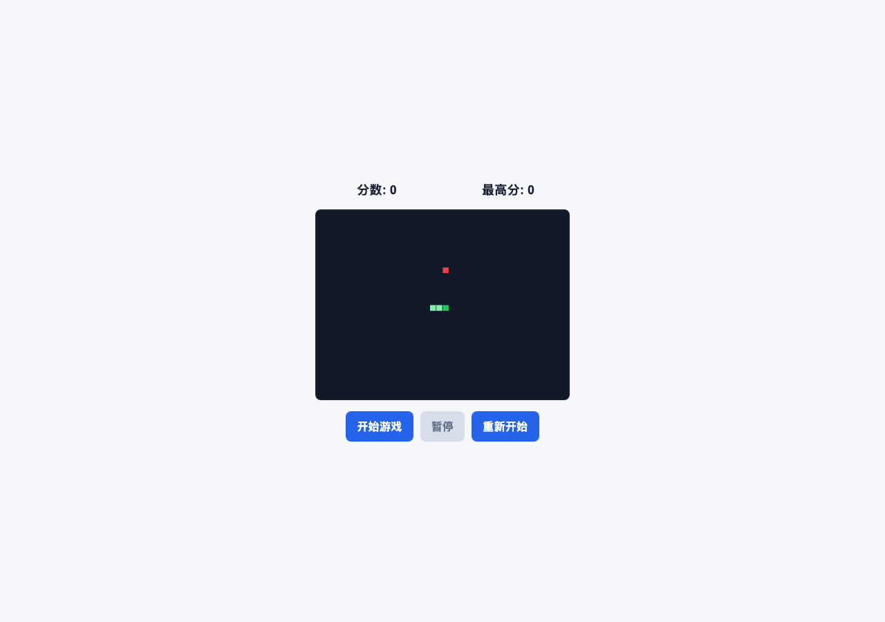

# 页面加载验收报告

日期：2026-06-19

## 项目结构与入口

- 工作目录：`/Users/lokli/Desktop/agent-project/empt-test`
- 入口文件：`index.html`
- 样式资源：`css/style.css`
- 脚本资源：`js/storage.js`、`js/input.js`、`js/game.js`
- 项目类型：静态 HTML5 Canvas 贪吃蛇小游戏，无构建配置或包管理文件

## 验收方式

- 首选静态服务：`python3 -m http.server 4173`
- 结果：当前沙箱禁止本地端口监听，返回 `PermissionError: [Errno 1] Operation not permitted`
- 实际打开方式：`file:///Users/lokli/Desktop/agent-project/empt-test/index.html`
- 浏览器工具：Python Playwright 1.60.0 + Chromium headless
- 浏览器启动补充参数：`--single-process --disable-gpu`

说明：默认 Chromium headless 多进程启动在当前 macOS 沙箱中被 Mach port 权限拦截；使用单进程参数后浏览器可正常启动并完成页面验收。

## 加载状态

- 页面 URL：`file:///Users/lokli/Desktop/agent-project/empt-test/index.html`
- 响应状态：`200`
- `document.readyState`：`complete`
- 页面标题：`Canvas Game`
- HTML 语言：`zh-CN`
- 页面主体文本：

```text
分数: 0
最高分: 0
开始游戏
暂停
重新开始
```

## 关键渲染状态

- Canvas 元素：存在
- Canvas 内部尺寸：`800 x 600`
- Canvas 页面显示尺寸：`364 x 272`
- Canvas 中心像素：`[17, 24, 39, 255]`
- `window.snakeGame`：存在
- 游戏初始状态：`idle`
- 当前分数：`0`
- 最高分：`0`
- 开始按钮：启用
- 暂停按钮：禁用
- 重新开始按钮：启用

## 控制台与错误摘要

- Console messages：`0`
- Page errors：`0`
- Request failures：`0`
- 结论：未发现控制台错误、页面运行时错误或资源加载失败。

## 页面截图



截图文件：`reports/acceptance-screenshot.png`

## 结论

验收通过。入口页面可以正常加载，核心资源成功生效，Canvas 游戏初始画面完成渲染，浏览器控制台无错误。
